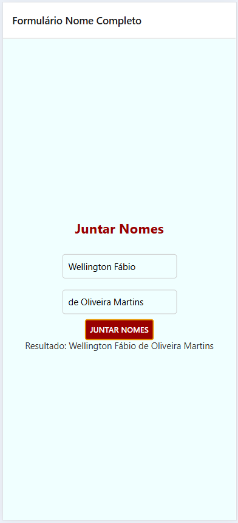

# FormNome

Projeto [Expo](https://expo.dev) criado com [`create-expo-app`](https://www.npmjs.com/package/create-expo-app) para estudar React Native.



## Como executar

1. Instale as dependencias

   ```bash
   npm install
   ```

2. Inicie o app

   ```bash
   npx expo start
   ```
