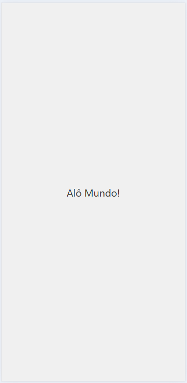
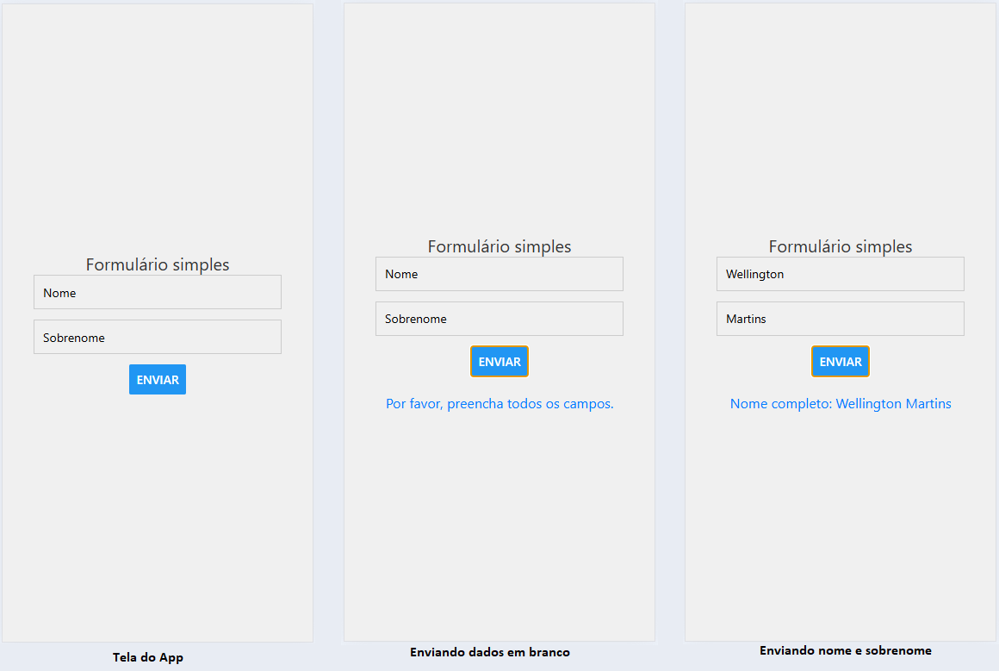

# Editando app/indexs.tsx - Olá Mundo e Criando um formulário básico
Após criar um novo projeto Expo, abrir no VsCodee no terminal navegar até a pasta do projeto digite o comando `npm run reset-project` para garantir que o projeto esteja limpo e pronto para ser editado.
- Limpe o Layout editando o arquivo `app/_layout.tsx` para remover o cabeçalho e o rodapé, deixando apenas o conteúdo principal.
```ts
import { Stack } from "expo-router";

export default function RootLayout() {
  return <Stack
    screenOptions={{
      headerShown: false,
    }}
  />;
}
```
- Vamos editar o arquivo `app/index.tsx` para exibir uma mensagem simples "Alô Mundo!" na tela inicial do aplicativo. Primeiro, certifique-se de que o Expo está instalado e funcionando corretamente. Você pode verificar isso com o comando:



```tsx
import React from 'react';
import { View, Text } from 'react-native';
import { StyleSheet } from 'react-native';
const styles = StyleSheet.create({
  container: {
    flex: 1,
    justifyContent: 'center',
    alignItems: 'center',
    backgroundColor: '#f0f0f0',
  },
  text: {
    fontSize: 20,
    color: '#333',
  },
});
const App = () => {
  return (
    <View style={styles.container}>
      <Text style={styles.text}>Alô Mundo!</Text>
    </View>
  );
};
export default App;
```

## Criando um formulário básico
Agora, vamos criar um formulário simples com dois campos nome e sobrenome e um botão de envio que ao ser clicado mostra o nome completo em uma área de mensagem abaixo do botão.<br>Substitua o conteúdo do arquivo `app/index.tsx` pelo seguinte código:

```tsx
import React, { useState } from 'react';
import { View, Text, TextInput, Button, Alert } from 'react-native';
import { StyleSheet } from 'react-native';

const styles = StyleSheet.create({
  container: {
    flex: 1,
    justifyContent: 'center',
    alignItems: 'center',
    backgroundColor: '#f0f0f0',
  },
  text: {
    fontSize: 20,
    color: '#333',
  },
  input: {
    height: 40,
    borderColor: '#ccc',
    borderWidth: 1,
    marginBottom: 12,
    paddingHorizontal: 10,
    width: '80%',
  },
  message: {
    marginTop: 20,
    fontSize: 16,
    color: '#007AFF',
    textAlign: 'center',
  },
});

const App = () => {
  const [firstName, setFirstName] = useState('');
  const [lastName, setLastName] = useState('');
  const [message, setMessage] = useState('');

  const handleSubmit = () => {
    if (!firstName || !lastName) {
      setMessage('Por favor, preencha todos os campos.');
      return;
    }
    const fullName = `${firstName} ${lastName}`;
    setMessage(`Nome completo: ${fullName}`);
  };

  return (
    <View style={styles.container}>
      <Text style={styles.text}>Formulário simples</Text>
      <TextInput
        style={styles.input}
        placeholder="Nome"
        value={firstName}
        onChangeText={setFirstName}
      />
      <TextInput
        style={styles.input}
        placeholder="Sobrenome"
        value={lastName}
        onChangeText={setLastName}
      />
      <Button title="Enviar" onPress={handleSubmit} />
      {message ? <Text style={styles.message}>{message}</Text> : null}
    </View>
  );
};

export default App;
```
### Resultado
