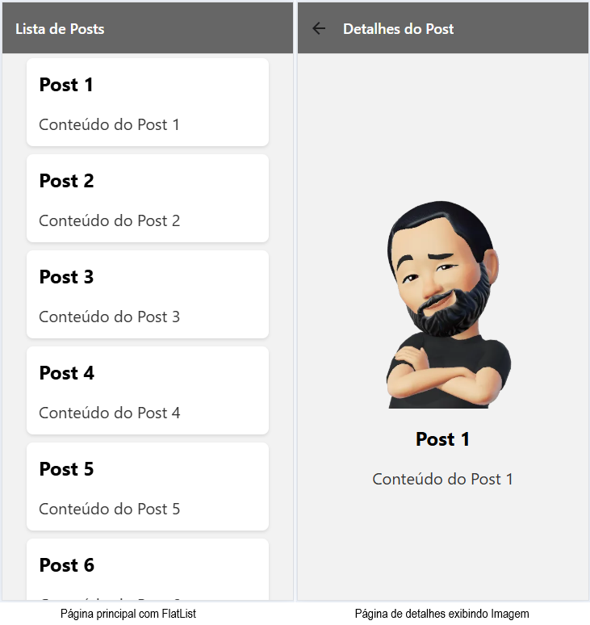

# Expo-router - Navegação em Aplicativos React Native
O Expo-router é uma biblioteca que facilita a navegação em aplicativos React Native, permitindo uma estrutura de rotas baseada em arquivos. Neste tutorial, vamos aprender como configurar o Expo-router e criar um formulário simples.

## Configuração Inicial - Pilha de Navegação
Para começar, certifique-se de ter o Expo CLI instalado. Se ainda não o fez, você pode instalá-lo com o seguinte comando:

```bash
npm install -g expo-cli
```

Em seguida, crie um novo projeto React Native com o Expo, já na versão mais recente do Expo que possui o Expo-router integrado:

```bash
npx create-expo-app@latest meu-projeto
cd meu-projeto
npm run reset-project
```

## Configuração do Expo-router
Acesse a pasta ./app do seu projeto e verá dois arquivos: `index.tsx` e `_layout.tsx`. O arquivo `_layout.tsx` é responsável por definir a estrutura de navegação do aplicativo.
- Vamos criar um layout básico com duas telas: uma para listar itens e outra para exibir detalhes.
- Edite o arquivo `_layout.tsx` para incluir as telas de lista e detalhes:

```tsx
import React from 'react';
import { Stack } from 'expo-router';
import { StyleSheet } from 'react-native';
const styles = StyleSheet.create({
  container: {
    flex: 1,
    backgroundColor: '#fff',
  },
});
const Layout = () => {
  return (
    <Stack
      screenOptions={{
        headerStyle: styles.container,
        headerTitleStyle: { color: '#000' },
      }}
    >
      <Stack.Screen name="index" options={{ title: 'Lista de Itens' }} />
      <Stack.Screen name="dets" options={{ title: 'Detalhes do Item' }} />
    </Stack>
  );
};
export default Layout;
```
- Para dados de exemplo e simulação, crie um arquivo `app/data.ts` com o seguinte conteúdo:
```tsx
export const posts = [
  { id: 1, title: 'Post 1', content: 'Conteúdo do Post 1', image: 'https://wellifabio.github.io/assets/avts/av1.webp' },
  { id: 2, title: 'Post 2', content: 'Conteúdo do Post 2', image: 'https://wellifabio.github.io/assets/avts/av2.webp' },
  { id: 3, title: 'Post 3', content: 'Conteúdo do Post 3', image: 'https://wellifabio.github.io/assets/avts/av3.webp' },
  { id: 4, title: 'Post 4', content: 'Conteúdo do Post 4', image: 'https://wellifabio.github.io/assets/avts/av4.webp' },
  { id: 5, title: 'Post 5', content: 'Conteúdo do Post 5', image: 'https://wellifabio.github.io/assets/avts/av5.webp' },
  { id: 6, title: 'Post 6', content: 'Conteúdo do Post 6', image: 'https://wellifabio.github.io/assets/avts/av6.webp' },
  { id: 7, title: 'Post 7', content: 'Conteúdo do Post 7', image: 'https://wellifabio.github.io/assets/avts/av1.webp' },
  { id: 8, title: 'Post 8', content: 'Conteúdo do Post 8', image: 'https://wellifabio.github.io/assets/avts/av2.webp' },
  { id: 9, title: 'Post 9', content: 'Conteúdo do Post 9', image: 'https://wellifabio.github.io/assets/avts/av3.webp' },
  { id: 10, title: 'Post 10', content: 'Conteúdo do Post 10', image: 'https://wellifabio.github.io/assets/avts/av4.webp' },
  { id: 11, title: 'Post 11', content: 'Conteúdo do Post 11', image: 'https://wellifabio.github.io/assets/avts/av5.webp' },
  { id: 12, title: 'Post 12', content: 'Conteúdo do Post 12', image: 'https://wellifabio.github.io/assets/avts/av6.webp' },
];
```

## Editando os arquivos de página
### Página de Lista (`app/index.tsx`)
```tsx
import { Text, View } from "react-native";

export default function Index() {
  return (
    <View
      style={{
        flex: 1,
        justifyContent: "center",
        alignItems: "center",
      }}
    >
      <Text>Primeira página de lista</Text>
    </View>
  );
}
```
### Página de Detalhes (`app/dets.tsx`)
```tsx
import { Text, View } from "react-native";

export default function Index() {
  return (
    <View
      style={{
        flex: 1,
        justifyContent: "center",
        alignItems: "center",
      }}
    >
      <Text>Página de detalhes</Text>
    </View>
  );
}
```

## Testando o Aplicativo na Web
Para testar o aplicativo na web, execute o seguinte comando no terminal:

```bash
npx expo start --web
```
Isso abrirá o Expo Dev Tools no seu navegador, onde você poderá ver a lista de itens e clicar em cada um para ver os detalhes.
- Inspecione ele no navegador, escolha um modelo de celular e veja como o layout se adapta.
- Para tetar as rotas no navegador adicione `/dets` ao final da URL, por exemplo: `http://localhost:8081/dets`.
  - A página de detalhes deve ser exibida corretamente.
  - Para voltar à lista basta remover `/dets` da URL `http://localhost:8081/`, pois é o arquivo `index.tsx` que está sendo exibido na rota raiz.

### Exibindo Dados nas Páginas
Para exibir dados nas páginas, vamos importar os dados do arquivo `data.ts` e usá-los nas páginas de lista e detalhes.
### Atualizando a Página de Lista (`app/index.tsx`)
```tsx
import { View, Text, TouchableOpacity, FlatList } from 'react-native';
import { StyleSheet } from 'react-native';
import React from 'react';

import { posts } from './posts';
import { router } from 'expo-router';

const styles = StyleSheet.create({
  container: {
    flex: 1,
    justifyContent: 'center',
    alignItems: 'center',
  },
  title: {
    fontSize: 24,
    fontWeight: 'bold',
    marginBottom: 20,
  },
  text: {
    fontSize: 20,
    color: '#333',
  },
  list: {
    width: '100%',
    paddingHorizontal: 20,
  },
  listItem: {
    backgroundColor: '#fff',
    padding: 15,
    marginVertical: 5,
    marginHorizontal: 10,
    borderRadius: 8,
    shadowColor: '#000',
    shadowOffset: {
      width: 0,
      height: 2,
    },
    shadowOpacity: 0.1,
    shadowRadius: 3.84,
    elevation: 5,
  },
});

export default function Index() {
  const verDetalhes = (id: number, title: string, content: string, image: string) => {
    router.push(`/dets?id=${id}&title=${title}&content=${content}&image=${image}`); // Use router.push to navigate to the details page with parameters
  }
  return (
    <View style={styles.container}>
      <FlatList style={styles.list}
        data={posts}
        keyExtractor={(item) => String(item.id)}
        renderItem={({ item }) => (
          <TouchableOpacity style={styles.listItem} onPress={() => verDetalhes(item.id, item.title, item.content, item.image)}>
            <Text style={styles.title}>{item.title}</Text>
            <Text style={styles.text}>{item.content}</Text>
          </TouchableOpacity>
        )}
      />
    </View>
  );
}
```
### Atualizando a Página de Detalhes (`app/dets.tsx`)
```tsx
import { Text, View, Image } from "react-native";
import { StyleSheet } from 'react-native';
import { router, useLocalSearchParams } from 'expo-router';
import React from "react";

const styles = StyleSheet.create({
  container: {
    flex: 1,
    justifyContent: 'center',
    alignItems: 'center',
  },
  title: {
    fontSize: 24,
    fontWeight: 'bold',
    marginBottom: 20,
  },
  text: {
    fontSize: 20,
    color: '#333',
  },
});

export default function Index() {
  const params = useLocalSearchParams();
  console.log('params', params);
  return (
    <View
      style={styles.container}
    >
      <Image
        source={{ uri: Array.isArray(params.image) ? params.image[0] : params.image }}
        style={{ width: 300, height: 300, marginBottom: 20 }}
        resizeMode="cover"
      />
      <Text style={styles.title}>{params.title}</Text>
      <Text style={styles.text}>{params.content}</Text>
    </View>
  );
}
```

## O Resultado Final
Agora, ao executar o aplicativo, você deve ver uma lista de itens. Ao clicar em um item, você será redirecionado para a página de detalhes, onde poderá ver o título, conteúdo e imagem do item selecionado.
