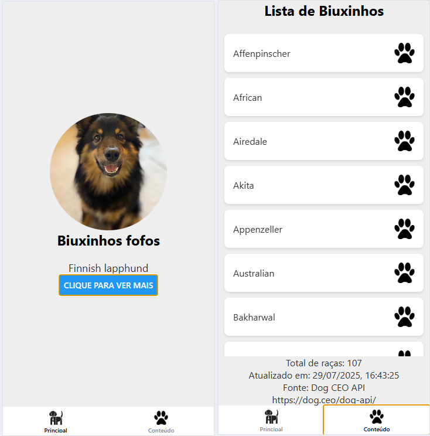

# Expo-router - Navegação em Aplicativos React Native
O Expo-router é uma biblioteca que facilita a navegação em aplicativos React Native, permitindo uma estrutura de rotas baseada em arquivos. Neste tutorial, vamos aprender como configurar o Expo-router e criar um formulário simples.

## Configuração Inicial - Abas de Navegação com Tabs
Para começar, certifique-se de ter o Expo CLI instalado. Se ainda não o fez, você pode instalá-lo com o seguinte comando:

```bash
npm install -g expo-cli
```

Em seguida, crie um novo projeto React Native com o Expo, já na versão mais recente do Expo que possui o Expo-router integrado:

```bash
npx create-expo-app@latest meu-projeto
cd meu-projeto
npm run reset-project
```

## Configuração do Expo-router
Acesse a pasta ./app do seu projeto e verá dois arquivos: `index.tsx` e `_layout.tsx`. O arquivo `_layout.tsx` é responsável por definir a estrutura de navegação do aplicativo.
- Vamos criar um layout básico com duas telas: uma para listar itens e outra para exibir detalhes.
- Edite o arquivo `_layout.tsx` para incluir as telas de lista e detalhes:

```tsx
import React from 'react';
import { Tabs } from 'expo-router';
import { StyleSheet } from 'react-native';
const styles = StyleSheet.create({
  container: {
    flex: 1,
    backgroundColor: '#fff',
  },
});
const Layout = () => {
  return (
    <Tabs
      screenOptions={{
        headerStyle: styles.container,
        headerTitleStyle: { color: '#000' },
      }}
    >
      <Tabs.Screen name="index" options={{ title:'Principal',headerShown:false }} />
      <Tabs.Screen name="contents" options={{ title:'Conteúdo', headerShown:false }} />
    </Tabs>
  );
};
export default Layout;
```
## Editando os arquivos de página
### Página de Lista (`app/index.tsx`)
```tsx
import { Text, View } from "react-native";

export default function Index() {
  return (
    <View
      style={{
        flex: 1,
        justifyContent: "center",
        alignItems: "center",
      }}
    >
      <Text>Página principal</Text>
    </View>
  );
}
```
### Página de Detalhes (`app/contents.tsx`)
```tsx
import { Text, View } from "react-native";

export default function Index() {
  return (
    <View
      style={{
        flex: 1,
        justifyContent: "center",
        alignItems: "center",
      }}
    >
      <Text>Página de conteúdos</Text>
    </View>
  );
}
```

## Testando o Aplicativo na Web
Para testar o aplicativo na web, execute o seguinte comando no terminal:

```bash
npx expo start --web
```
Isso abrirá o Expo Dev Tools no seu navegador, onde você poderá ver a lista de itens e clicar em cada um para ver os detalhes.
- Inspecione ele no navegador, escolha um modelo de celular e veja como o layout se adapta.
- Como são abas basta clicar nas abas "Conteúdo" e "Principal" para navegar entre as telas.

## Editando as páginas com um tema
Para fazer mais sentido vamos obter dados da API https://dog.ceo/dog-api/ e exibir uma tela principal apresentando o assunto Cachorrinhos, e uma tela de conteúdos com uma lista de cachorros.
### Reconfigurando o `_layout.tsx` para incluir ícones e estilos
```tsx
import React from 'react';
import { Tabs } from 'expo-router';
import { StyleSheet, Image } from 'react-native';
const styles = StyleSheet.create({
  container: {
    flex: 1,
    backgroundColor: '#fff',
  },
});
const Layout = () => {
  return (
    <Tabs
      screenOptions={{
        headerStyle: styles.container,
        headerTitleStyle: { color: '#000' },
        tabBarActiveTintColor: '#000',
        tabBarInactiveTintColor: '#888',
        tabBarStyle: {
          backgroundColor: '#fff',
          borderTopWidth: 0,
          elevation: 0,
        },
      }}
    >
      <Tabs.Screen name="index" options={{
        title: 'Principal', headerShown: false, tabBarIcon: () => {
          return (
            <Image
              source={{ uri: 'https://dog.ceo/img/dog-api-logo.svg' }}
              style={{ width: 24, height: 24 }}
              resizeMode="contain"
            />
          );
        },
      }} />
      <Tabs.Screen
        name="contents"
        options={{
          title: 'Conteúdo',
          headerShown: false,
          tabBarIcon: () => {
            return (
              <Image
                source={{ uri: 'https://cdn-icons-png.flaticon.com/512/12/12638.png' }}
                style={{ width: 24, height: 24 }}
                resizeMode="contain"
              />
            );
          },
        }}
      />
    </Tabs>
  );
};
export default Layout;
```
### Página Principal (`app/index.tsx`)
```tsx
import { useEffect, useState } from "react";
import { Text, View, Image, Button } from "react-native";
import { StyleSheet } from "react-native";
import React from 'react';

const styles = StyleSheet.create({
  container: {
    flex: 1,
    justifyContent: 'center',
    alignItems: 'center',
    backgroundColor: '#eee',
  },
  title: {
    fontSize: 24,
    fontWeight: 'bold',
    marginBottom: 20,
  },
  image: {
    width: 200,
    height: 200,
    borderRadius: 100,
  },
  text: {
    fontSize: 18,
    color: '#333',
  }
});

export default function Index() {
  const [img, setImg] = useState('https://images.dog.ceo/breeds/terrier-russell/iguet3.jpg');
  const [nome, setNome] = useState('terrier-russell');

  async function fetchData() {
    const response = await fetch("https://dog.ceo/api/breeds/image/random");
    const data = await response.json();
    setImg(data.message);
    //Deixando a primeira letra maiúscula e formatando o nome
    setNome(data.message.split('/')[4].split('-').join(' ').charAt(0).toUpperCase() + data.message.split('/')[4].split('-').join(' ').slice(1));
  }
  useEffect(() => {
    fetchData();
  }, []);

  return (
    <View style={styles.container}
    >
      <Image source={{ uri: img }} style={styles.image} />
      <Text style={styles.title}>Biuxinhos fofos</Text>
      <Text style={styles.text}>{nome}</Text>
      <Button
        title="Clique para ver mais"
        onPress={fetchData}
      />
    </View>
  );
}
```
### Página de Conteúdos (`app/contents.tsx`)
```tsx
import { useEffect, useState } from "react";
import { Text, View, Image, FlatList } from "react-native";
import { StyleSheet } from "react-native";
import React from 'react';

const styles = StyleSheet.create({
  container: {
    flex: 1,
    justifyContent: 'center',
    alignItems: 'center',
    backgroundColor: '#eee',
  },
  title: {
    fontSize: 24,
    fontWeight: 'bold',
    marginBottom: 20,
  },
  image: {
    width: 35,
    height: 35,
  },
  text: {
    fontSize: 16,
    color: '#333',
  },
  item: {
    flex: 1,
    flexDirection: 'row',
    alignItems: 'center',
    justifyContent: 'space-between',
    backgroundColor: '#fff',
    padding: 15,
    marginVertical: 5,
    marginHorizontal: 10,
    borderRadius: 8,
    shadowColor: '#000',
    shadowOffset: {
      width: 0,
      height: 2,
    },
    shadowOpacity: 0.1,
    shadowRadius: 3.84,
    elevation: 5,
  },
});

export default function Index() {
  const [lista, setList] = useState<string[]>([]);

  async function fetchData() {
    const response = await fetch("https://dog.ceo/api/breeds/list/all");
    const data = await response.json();
    console.log(data);
    setList(Object.keys(data.message));
  }
  useEffect(() => {
    fetchData();
  }, []);

  return (
    <View style={styles.container}
    >
      <Text style={styles.title}>Lista de Biuxinhos</Text>
      <FlatList
        style={{ width: '100%' }}
        data={lista}
        keyExtractor={(item) => item}
        renderItem={({ item }) => (
          <View style={styles.item}>
            <Text style={styles.text}>{item.charAt(0).toUpperCase() + item.slice(1)}</Text>
            <Image
              source={{ uri: `https://cdn-icons-png.flaticon.com/512/12/12638.png` }}
              style={styles.image}
              resizeMode="contain"
            />
          </View>
        )}
      />
      <Text style={styles.text}>Total de raças: {lista.length}</Text>
      <Text style={styles.text}>Atualizado em: {new Date().toLocaleString()}</Text>
      <Text style={styles.text}>Fonte: Dog CEO API</Text>
      <Text style={styles.text}>https://dog.ceo/dog-api/</Text>
    </View>
  );
}
```
## O Resultado Final
